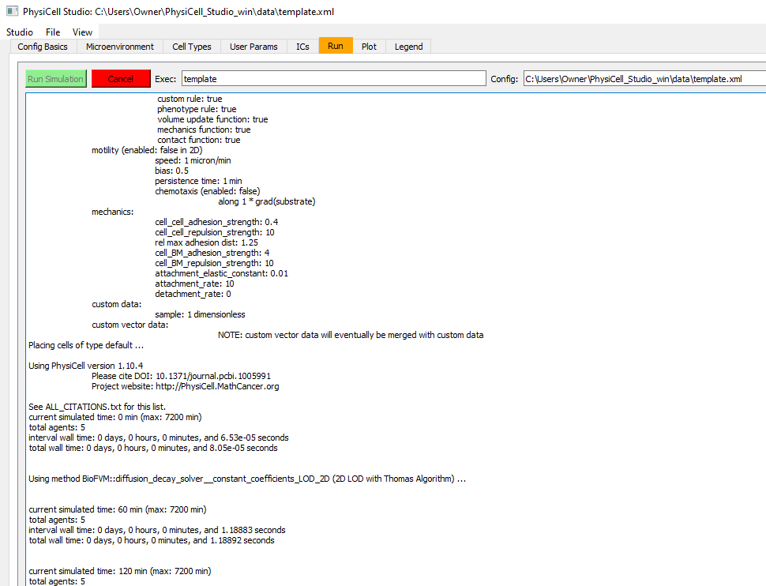
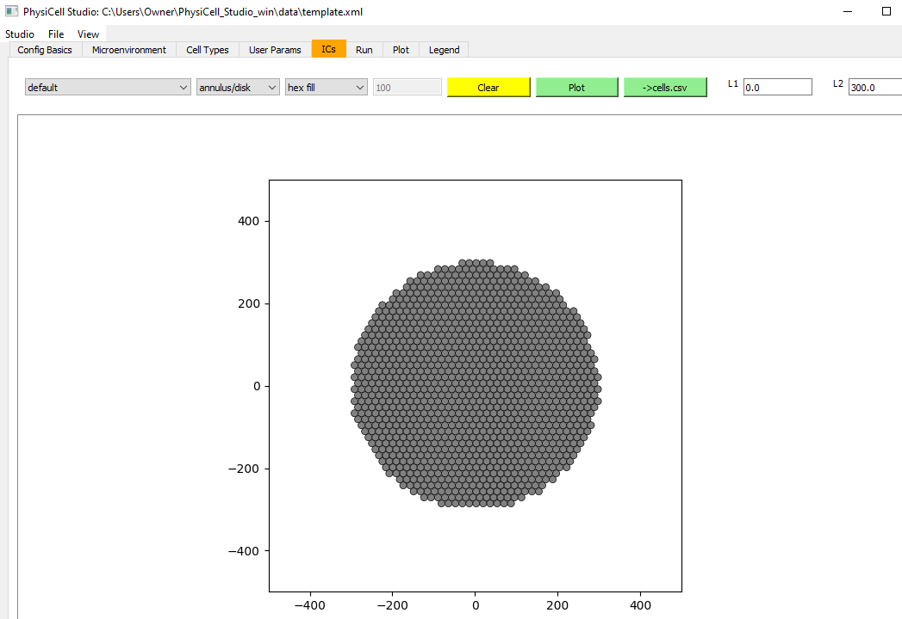

# PhysiCell Studio tutorial

# Installation

* Download the Model Builder/Studio from https://github.com/PhysiCell-Tools/PhysiCell-model-builder/releases (however, it will not contain an executable model, e.g., the `template` executable)
* Download a bundled PhysiCell Studio which includes the "template" executable model. Until we find a more permanent site for these bundles, they are currently on Dropbox:

  * for Windows: https://www.dropbox.com/s/wiwdd09f8pmmyyk/PhysiCell_Studio_win.zip?dl=0  (about 334 MB)
  * for Mac: https://www.dropbox.com/s/9e52bcupp663xci/PhysiCell_Studio.zip?dl=0   (about 227 MB)

You will run the Studio from the command line, e.g., Powershell on Windows; Terminal on Mac.

## Windows bundle
Navigate (via `cd` command) to the folder where you unzipped the Studio and then `cd` to the folder containing `PhysiCell_Studio.exe` and run it, e.g.:
```
PS C:\Users\Owner\PhysiCell_Studio_win\PhysiCell_Studio> .\PhysiCell_Studio.exe
(patiently wait...)
Matplotlib is building the font cache; this may take a moment.
self.current_dir =  C:\Users\Owner\PhysiCell_Studio_win\PhysiCell_Studio
self.pmb_root_dir =  C:\Users\Owner\PhysiCell_Studio_win
self.config_dir =  C:\Users\Owner\PhysiCell_Studio_win\PhysiCell_Studio\config
```

## MacOS bundle
Uncompress the .zip file, e.g., navigate to its directory and run `unzip PhysiCell_Studio.zip`. This will reveal a `PhysiCell_Studio.app` directory. 
Open a Finder window, navigate to this .app, right-click on it and select "Open". You'll be warned that "macOS cannot verify the developer...", but click the "Open" button on that warning dialog window. 
Then back in a Terminal window, navigate to the directory containing the `PhysiCell_Studio.app` and from there into `Contents/MacOS` and run the executable, e.g. :
```
~/PhysiCell_Studio.app/Contents/MacOS$ ./PhysiCell_Studio
```

# Getting Started

NOTE: if you do not use the menu `File -> Save as`, the .xml file that was loaded will be over-written when you run a simulation.

## Template model: default params

When the Studio displays, it will load the "template" sample model's parameters by default. And it will select `template[.exe]` as the executable in the `Run` tab. (Note that the "Config" path in the `Run` tab will be different for Windows and Mac). But the first tab displayed is the `Config Basics` which defines the model's spatial domain, the simulation's Max Time, and various other high-level parameters, including how often output files are saved for plotting (`Save data(intervals)`).


* the Configuration Basics tab that defines the domain and various high-level simulation parameters
---


* the Microenvironment tab where substrates and signals are defined. Just one substrate is defined in the default `template` model, but it is not used (yet).
---


* the Cell Types tab where different cell types can be defined to have different phenotypic behaviors. For the default `template` model, there is only one cell type defined (initially). Note there are subtabs which define each cell type's phenotype. If you look at some of those subtabs, you'll see that the default `template` model allows cell death and mechanics, but no motility and no secretion/uptake of the substrate.
---



* click the `Run simulation`. Information about the overall model will quickly appear, followed by delayed output lines whenever output files are saved (based on the time intervals on the `Config Basics` tab).
---


* At time=0, we see the initial conditions: 5 cells positioned randomly in the domain. Note the "5" is specified in the `User Params` tab as the "number_of_cells".
---


* Results (cells) at the end of the simulation (5 days).
---

## Template model: changing initial conditions


* the `ICs` (Initial Conditions) tab lets us define some relatively simple starting positions for cells. The output will be a .csv file containing: `x,y,z,cell type` Here, we create a disk of hexagonally packed cells. Press `Plot` to see results and `->cells.csv` to write the .csv file. You will then provide this .csv filename on the Config Basics tab.
---


* In the `Config Basics` tab, we need to :heavy_check_mark: enable the cells.csv and change the folder to be "."
---


* the `User Params` tab defines parameters considered to be "global" to a simulation (vs. `Custom Data`, the subtab in `Cell Types` which define parameters specific to cell types). Here, we change # of randomly placed cells to be 0 (because we only want to use the cells defined in the .csv file).
---


* when we run the simulation now, we see there are 1150 cells initially (all from the cells.csv).
---


* results after 20 hours. Note the cells are unrealistically overlapping, a situation we can adjust with additional edits to the model.
---


